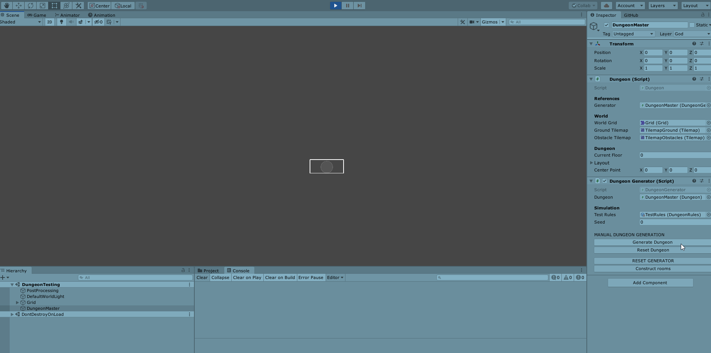

# **DUNGEON GAME** 

Unfinished roguelike dungeon crawler game
WIP Dungeon layout generation is in place. Amount and size parameters for rooms can be specified

***

Example gif of layout generation using colliders and rigidbodies. The bounds are then filled with tiles after the physical simulation has finished.
Inspired by [this article published on Gamasutra](https://www.gamasutra.com/blogs/AAdonaac/20150903/252889/Procedural_Dungeon_Generation_Algorithm.php)

